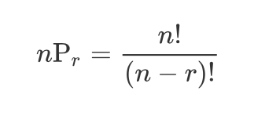

# Permutation

* Selecting r items from n different elements without duplicates and arranging them in order
* The folmula as below

* Implemented as full search for all possible combinations, not simple number of cases

* Recursive permutation allows duplication of elements. 