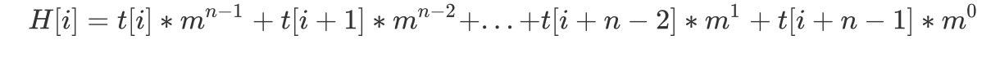

# Rabin Karp

* Rabin Karp is an algorithm that finds 1:1 matching based on hashing
* So, there are a lot of collision.  To reduce collision, Usually the MOD is set to very large prime number.
* There may still be collisions, so the existance of the string is checked through simple comparision only when hash value is same.

* Rabin Karp algorithm usually using `Rabin fingerprint algorithm`

* So, `Rabin fingerprint algorithm` transfered like belows

* So, best case, time complexity is O(N+M).
* But worst case such as "AAAAAAAA", "AAA" : time complexity is O(NM)

